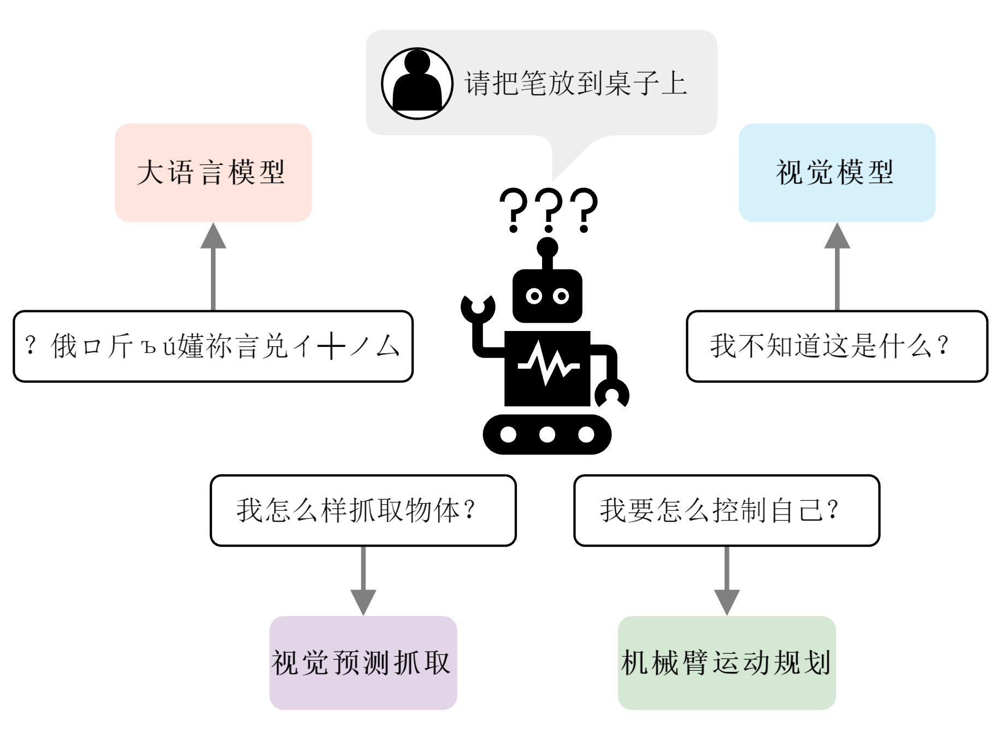
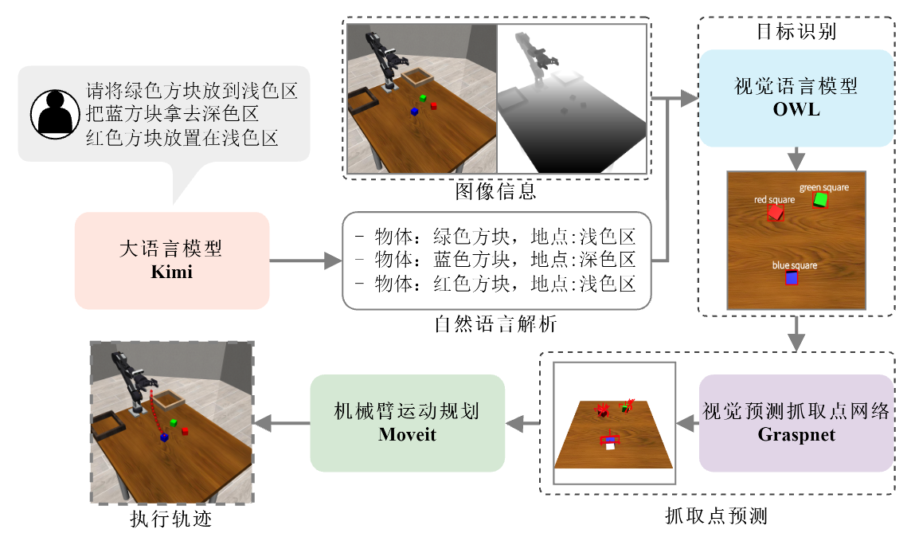
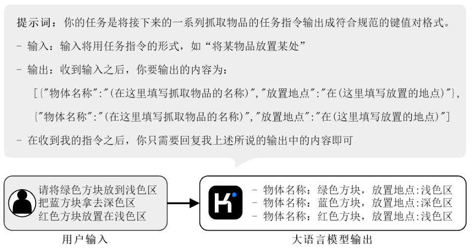
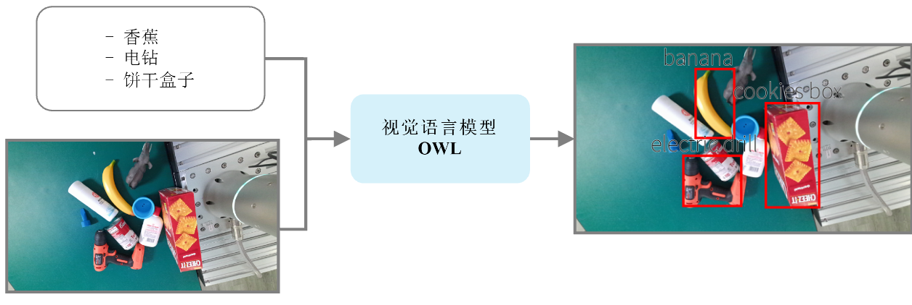
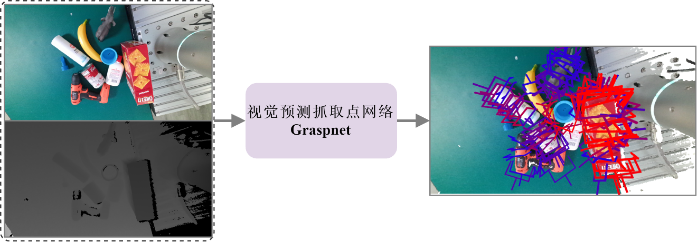
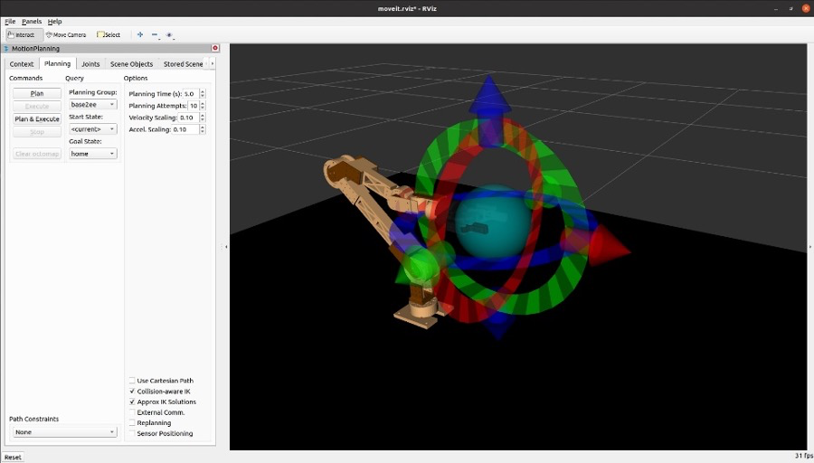
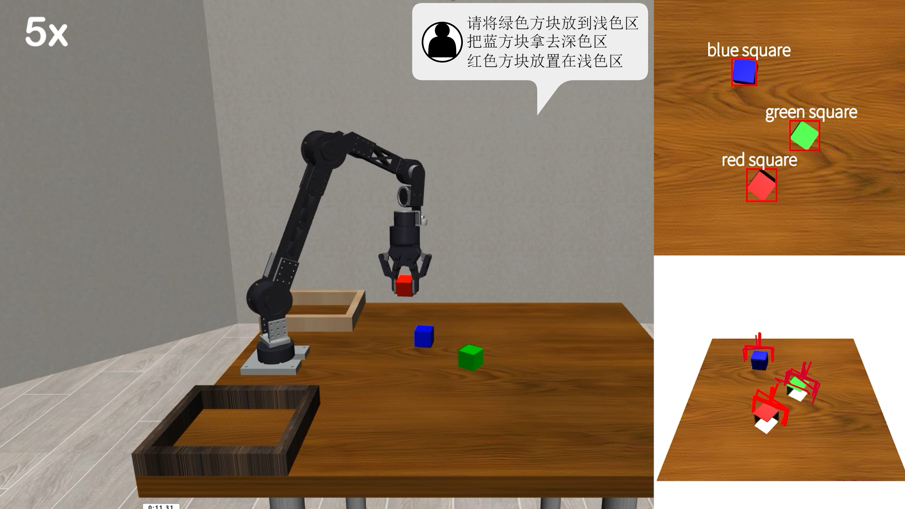

# 具身智能机械臂AI算法实验报告

**学生姓名**: 庄善宁
**学号**: 2050828
**日期**: 2024.05.28

---

### 1. 任务描述

本次任务的核心目标是为一款六轴协作机械臂搭建一套AI系统，使其能够理解人类的自然语言指令，并自主完成智能化的物体抓取与放置任务。具体而言，该系统需要将用户的口头或书面指令（例如"把红色的方块放到蓝色区域"）转化为机器人精确的物理动作。这要求系统具备四大核心能力：

1.  **自然语言理解**：解析用户指令的意图，识别出需要操作的目标物体和目标位置。
2.  **视觉感知与目标检测**：通过摄像头识别工作场景，并从中定位到指令中提到的具体物体。
3.  **抓取姿态估计**：针对识别出的物体，智能地判断出最合适的抓取位置和姿态，以保证抓取的成功率。
4.  **运动规划与执行**：在知晓了抓取目标和最终放置点后，规划出一条从当前位置到目标、再到终点的无碰撞、平滑的运动轨迹，并控制机械臂执行。

### 2. 具体方法

为了实现上述任务，我们设计并集成了一个由多个AI模型串联而成的模块化处理流程，整个流程在机器人操作系统（ROS）的框架下进行协调与通信。

**算法流程图:**

**各模块详解:**

1.  **指令解析 (大语言模型)**: 用户指令首先被输入到月之暗面公司研发的**Kimi**大语言模型中。通过精心设计的提示词（Prompt），Kimi能够准确地从自然语言中提取关键信息，并将其格式化为一个JSON对象，例如 `{"object": "red block", "destination": "blue area"}`，为后续模块提供结构化的输入。

2.  **零样本目标检测 (视觉语言模型)**: 机械臂的摄像头捕捉工作区域的实时图像。随后，Google的**OWL-ViT (Vision Transformer for Open-World Localization)**模型接收图像和上一步从Kimi解析出的物体名称。OWL-ViT利用其强大的零样本学习能力，即便没有经过特定物体的训练，也能在图像中准确地定位出目标物体，并输出其2D边界框坐标。

3.  **抓取姿态预测 (GraspNet)**: 在获得物体的2D位置后，**GraspNet**模型登场。它结合了RGB图像和深度图像（RGB-D），对目标物体的三维几何形状进行分析，并从中预测出多个可能的、稳定的6D抓取位姿（包括三维空间坐标和三维抓取姿态）。系统会从中选择一个最优的抓取点。

4.  **轨迹规划 (MoveIt)**: 预测出的抓取位姿是基于相机坐标系的，需要先将其转换到机械臂的基坐标系下。然后，这个目标位姿被传递给ROS中的核心运动规划组件**MoveIt**。MoveIt结合了机械臂的URDF（统一机器人描述格式）模型，综合考虑了运动学、动力学和环境中的障碍物信息，计算出一条平滑且无碰撞的运动轨迹，最后将轨迹点序列通过CAN总线发送给机械臂的各个关节电机，驱动机械臂完成最终的抓取和放置动作。

### 3. 结果描述

我们在**Mujoco**物理仿真环境中对整套AI算法流程进行了验证。实验任务设定为：将桌面上随机摆放的红、绿、蓝三种颜色的方块，根据指令放置到对应的区域。

在总计**1000次**的仿真实验中，系统成功完成抓取和放置任务的成功率为**89.6%**。

对失败案例的分析表明，问题主要源于以下几个方面：
*   **抓取点不可达**：GraspNet预测出的抓取位姿虽然理论上稳定，但有时超出了机械臂的实际工作范围或处于奇异点附近，导致运动规划失败。
*   **路径碰撞**：当方块堆叠或距离过近时，MoveIt在规划路径时，虽然能避免机械臂本体与障碍物碰撞，但有时会忽略夹爪上"携带"的方塊的体积，导致在移动过程中，被抓取的方块碰到了桌面上的其他方块，造成任务失败。
*   **缺乏闭环反馈**：系统采用"开环"执行模式，即在任务开始时拍摄一张照片进行决策，执行过程中不再接收视觉反馈。这导致如果中途发生意外（如上文提到的碰撞），系统无法进行动态调整，从而导致连锁失败。

### 4. 体会与建议

#### 4.1 对本次任务的体会

本次大作业是一次将前沿AI技术与机器人学深度结合的宝贵实践。最大的体会是，现代AI的发展，尤其是大模型的出现，正在颠覆传统的机器人编程范式。过去需要为每个任务编写复杂、僵硬的控制代码，而现在我们可以通过组合不同的预训练模型，构建一个能"理解"和"感知"的智能系统，极大地提高了开发的效率和机器人的智能化水平。

然而，实践过程也让我深刻认识到，将多个AI模型"粘合"成一个可靠的系统远非易事。挑战不仅在于单个模型的性能，更在于模型之间的"接口"和"协作"。例如，如何处理坐标系转换的精度问题，如何保证上一个模型的输出是下一个模型的有效输入，以及如何设计一套容错机制来应对某个模型的偶然失效，这些都是工程实践中必须解决的关键问题。

总的来说，这个任务让我从一个更高的维度理解了具身智能——它不仅是算法，更是一个需要软硬件协同、算法与物理世界交互的复杂系统工程。

#### 4.2 对课程的后续建议

结合本次毕业设计的经验，我对后续课程提出以下几点建议：

1.  **开设《机器人系统集成》课程**：目前多数课程都专注于单个领域，如"机器学习"或"控制理论"。但如何将这些知识融会贯通，构建一个完整的机器人应用，是学生们普遍欠缺的能力。建议开设一门以项目为导向的系统集成课程，重点讲授**ROS**等框架的使用，以及多传感器数据融合、多模块通信和软硬件接口调试等实践技能。

2.  **加强"仿真到现实 (Sim-to-Real)"的教学**：本次任务的AI算法在仿真中取得了不错的成果，但要将其部署到真实机械臂上，必然会遇到模型不准、延迟、噪声等新问题。建议在课程中加入"Sim-to-Real"相关内容，介绍领域自适应、系统辨识、鲁棒控制等技术，帮助学生填平仿真与现实之间的鸿沟。

3.  **鼓励跨学科合作**：具身智能是一个典型的交叉学科领域。可以设计一些需要计算机、机械、电子等不同专业背景学生共同完成的课程项目，让他们在合作中学习如何从系统角度思考问题，并了解不同学科的思维方式和工作流程。这对于培养能够应对未来复杂工程挑战的综合性人才至关重要。 